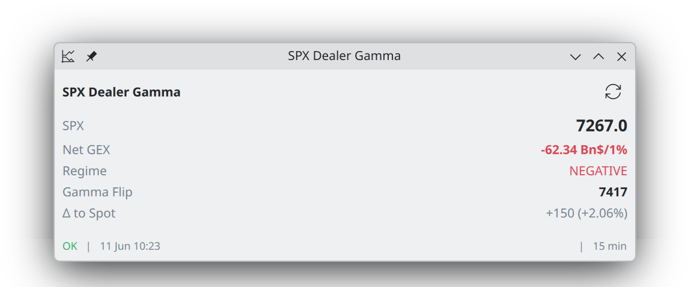
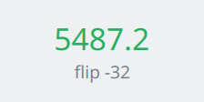
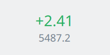
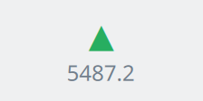

# SPX Dealer Gamma — KDE Plasma 6 Plasmoid

A small Plasma 6 panel widget that shows, at a glance:

- **SPX spot price** (CBOE delayed quotes, ~15 min; EOD snapshot after close)
- **Net dealer gamma exposure (GEX)** in Bn$ per 1% index move, with regime
  (positive = vol-dampening, negative = vol-amplifying)
- **Gamma flip level** (zero-gamma point) and its distance to spot

The gamma math is the engine in `package/contents/code/spx_gamma.py`
(SqueezeMetrics-style naive GEX, Black-Scholes gamma, zero-crossing flip).
`fetch_gamma.py` wraps it and prints one JSON line for the QML side.

## Screenshots

In a panel:


Expanded view — all numbers plus status bar:



## Panel display modes

Switchable in the widget settings (**Panel display**). Colour follows the gamma
regime: green = positive (vol-dampening), red = negative (vol-amplifying).

| 1. SPX price + regime color | 2. Net GEX value | 3. Regime glyph + price |
|:---:|:---:|:---:|
|  |  |  |
| spot price tinted by regime, flip distance below | net GEX colored by sign, spot below | ▲ / ▼ glyph for the regime, spot below |

The expanded view shows all numbers: SPX, Net GEX + regime, gamma flip and Δ to
spot, plus a status bar.

## Dependencies

```
pip install requests numpy pandas scipy
```

`python3` must be on PATH. If a dependency is missing, the widget shows a clear
error instead of failing silently.

## Install

```bash
bash scripts/install.sh           # kpackagetool6 --install
# then add "SPX Dealer Gamma" from the Plasma widget browser, or:
plasmawindowed com.chrisotm.spxgamma
```

Update after changes:

```bash
bash scripts/upgrade.sh
# or, for dev (auto install/upgrade + launch):
bash scripts/dev-reload.sh
```

Remove:

```bash
bash scripts/uninstall.sh
```

## Settings

- **Refresh interval** (minutes, default 15)
- **Panel display** (the three compact modes above)
- **Max days to expiry** (default 90) — caps which option expiries feed the GEX

## Manual test of the fetcher

```bash
cd package/contents/code
python3 fetch_gamma.py                       # live CBOE
python3 fetch_gamma.py --from-file chain.json # saved snapshot
```

A saved snapshot can be produced with the engine directly:
`python3 spx_gamma.py --save-json chain.json`.

## Notes

The dealer positioning model (long calls / short puts) is an **assumption**, not
a fact — see the docstring in `spx_gamma.py`. The flip level is the nearest
zero-crossing of the GEX-vs-spot profile to the current spot.

## License

MIT.
